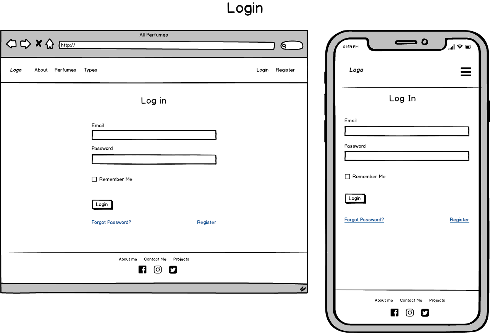
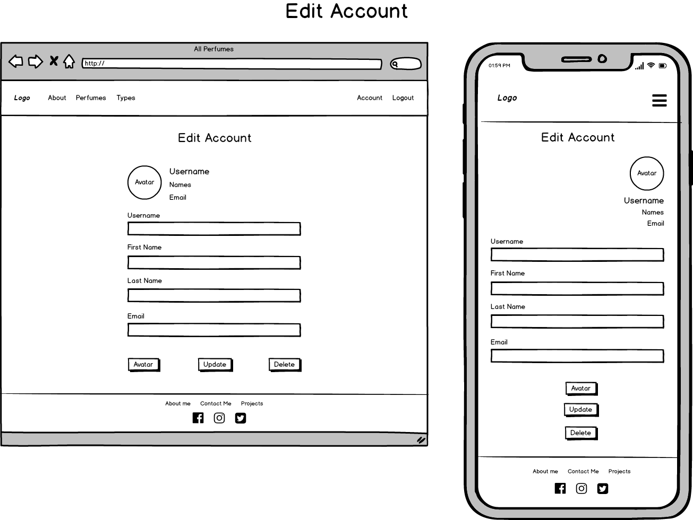
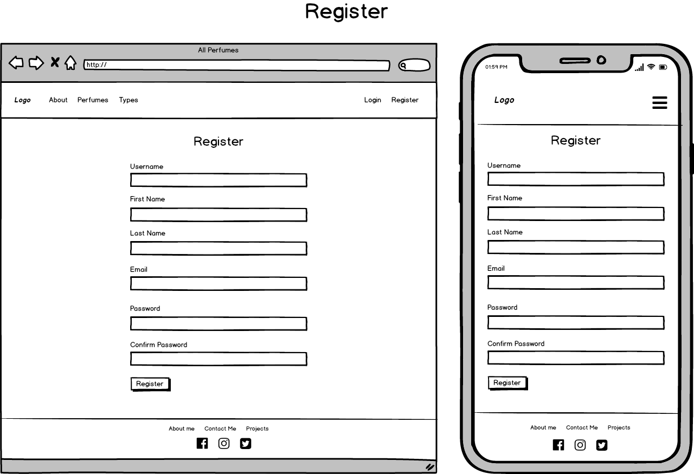
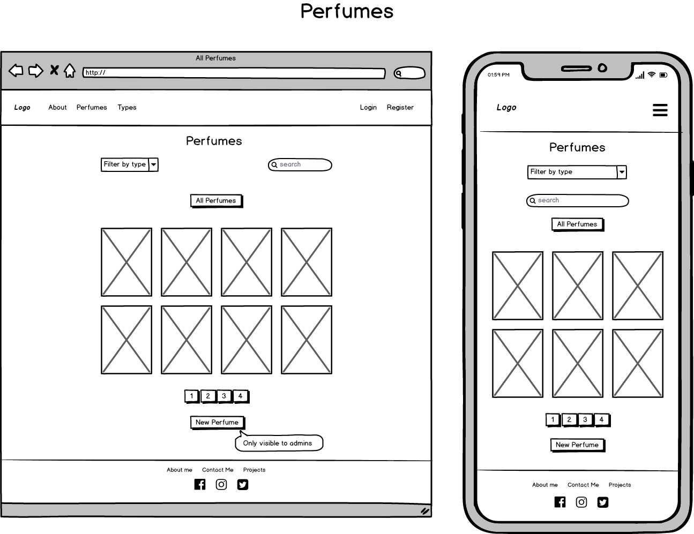
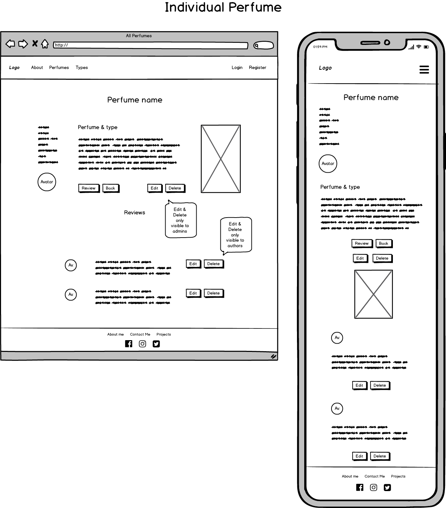
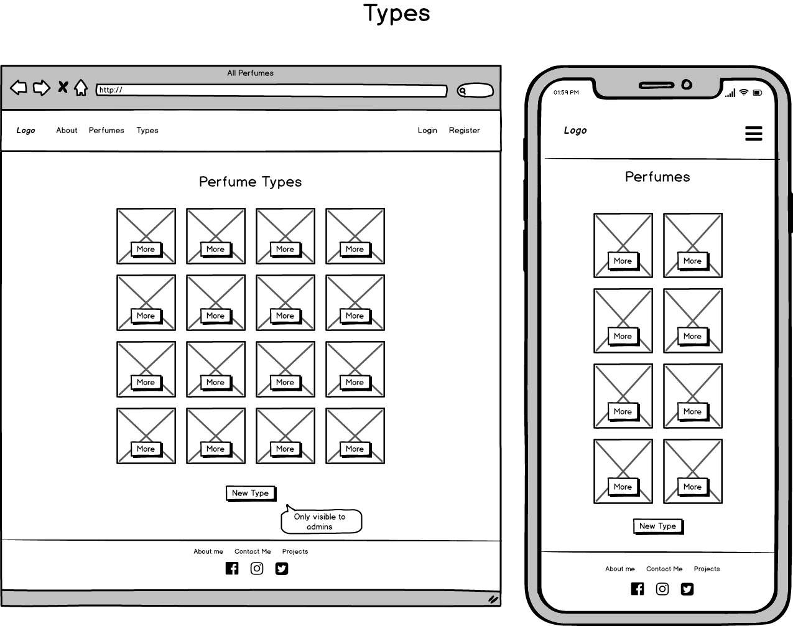
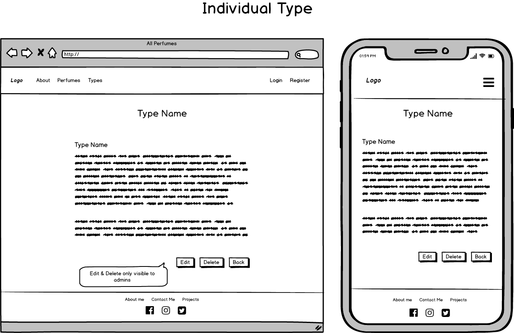
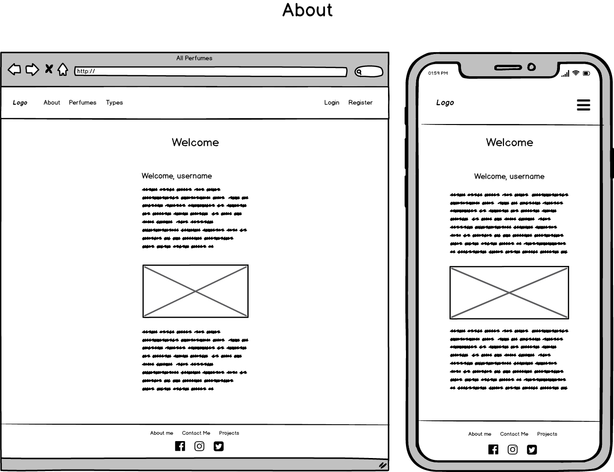

# Parfumier <!-- omit in toc -->


## Table of Contents <!-- omit in toc -->

- [Introduction](#introduction)
- [UX](#ux)
  - [Who is this website for](#who-is-this-website-for)
  - [Who are the primary target groups](#who-are-the-primary-target-groups)
  - [What is it that they (the users) want to achieve](#what-is-it-that-they-the-users-want-to-achieve)
  - [How is my project the best way to help them achieve those things](#how-is-my-project-the-best-way-to-help-them-achieve-those-things)
  - [How do users achieve each of the following goals](#how-do-users-achieve-each-of-the-following-goals)
- [Project Goals](#project-goals)
  - [User Goals](#user-goals)
  - [Visitor Goals](#visitor-goals)
- [User Stories](#user-stories)
- [Design Choices](#design-choices)
  - [General](#general)
  - [Buttons](#buttons)
  - [Colors](#colors)
- [Wireframes](#wireframes)
- [Features](#features)
  - [Existing Features](#existing-features)
    - [Login](#login)
    - [Account managment](#account-managment)
    - [Perfumes & Types](#perfumes--types)
    - [Admins](#admins)
    - [Images](#images)
    - [Custom Validator for types](#custom-validator-for-types)
    - [filters & Search](#filters--search)
  - [Future Goals](#future-goals)
- [Information Architecture](#information-architecture)
  - [Database Aggregation](#database-aggregation)
  - [Data Storage](#data-storage)
- [Technologies Used](#technologies-used)
  - [Front-end Technologies](#front-end-technologies)
  - [Back-end Technologies](#back-end-technologies)
  - [Other technologies](#other-technologies)
  - [About Cloudinary](#about-cloudinary)
  - [About CKEditor](#about-ckeditor)
  - [About Flask-paginate](#about-flask-paginate)
- [Testing](#testing)
  - [Tests performed](#tests-performed)
  - [Validators and linters](#validators-and-linters)
- [Issues found and status](#issues-found-and-status)
- [Deployment](#deployment)
  - [Local Development](#local-development)
  - [Heroku](#heroku)
  - [Version Control](#version-control)
- [Credits](#credits)
  - [Content](#content)
  - [Media](#media)
  - [Code](#code)
  - [Acknowledgements](#acknowledgements)
- [Disclaimer](#disclaimer)

---

## Introduction

I love fragrances and always wished to have an app allowing me to save my perfumes, share reviews and be able to connect with other perfume lovers.
This is the result of this passion.
Please send me a message if you would like to be an administrator and so be able to enter, edit and deal with perfumes.
If you are a visitor, please log in and share your comments on the perfumes in our databse.

## UX

### Who is this website for

This website is intended for all pefume lovers, people curious about perfumes, or people wishing to exchange comments, reviews and experiences around perfumes.

### Who are the primary target groups

People from all ages and origins, people wishing to discover new fragrances, to make a purchase and be informed before that.

### What is it that they (the users) want to achieve

Users want to learn about perfumes, get informed and read opinions from other users.
Users want also to be able to leave a review to collaborate with the database.

### How is my project the best way to help them achieve those things

The app is flexible and intuitive.
To the administrators it gives all the possibilities to interact with the database and so admins can edit all documents.
It is worth mentioning that the only limitation admins have is to delete documents not created by themselves, i.e. admins can edit types or perfumes, but won't be able to delete a record created by another admin.
A non-admin user will be able to browse and interact with all information in the database and add reviews or comments on the documents, plus be able to edit those interactions.
Users can edit all information related to their account, including their profile picture, and request a password reset.
To make all interaction as clear as possible, buttons are available only when they are available to the permissions of the user or admin.
Basic buttons are still visible in all instances, but attemptin to interact with some of the functions will redirect users to the route requiring them either to log in or register.
No anonymous writting to the database is permitter by the app.

### How do users achieve each of the following goals

After users log in, they can edit their account, add reviews, edit them, delete them and even delete their account.
Admins can add perfumes, types, and edit them.
Admins can also add or change perfume pictures.
Not logged visitors can see all information in the database.
Admins can delete perfumes except if they are not the creators of the record. They can still edit their content.
Users and admins can request a password reset link to be sent to their email account.
Users and admins can upload an avatar or picture, and change it at any time.

## Project Goals

The main goals of the project are

- Keep users informed about perfumes.
- Offer users a platform in which to share comments and reviews.
- Connect to other perfume lovers.
- Offer information before choosing a perfume.
- Share the enthusiasm about the fascinating world of fragrances.

### User Goals

### Visitor Goals

## User Stories

- As a user, I would like to find information about perfumes.
- As a user, I would like to be able to see what the bottle looks like.
- As a user, I would like to be able to search for a particular perfume.
- As a user, I would like to be able to filter perfumes by type.
- As a user, I would like to learn more about types of perfumes.
- As a user, I would like to be able to read reviews on a perfume.
- As a user, I would like to be able to write my own review on a perfume.
- As a user, I would like to be able to create an account and modify it.
- As a user, I would like to upload an avatar or photo of my choice, and preview it before I do so.
- As a user, I would like to be able to change that photo at any point.
- As a user, I would like to see my photo next to my reviews on perfumes.
- As a user, I would like to have the possibility to create a new password in case I forgot my current one.
- As a user, I would like to have the possibility to edit or delete my reviews on a perfume.
- As a user, I would like to have the possibility to delete my account.
- As a user, I

As an administrator, I would like to do all of the above, plus ______________"

- Be able to create, modify and delete perfumes.
- Be able to upload a photo of the perfume, and to change it.
- Be able to preview the photo I'm about to upload.
- Be able to create, modify and delete types of perfumes.

## Design Choices

### General

Like good perfumes, I decided to leave a lot to the suggestion of imagination.
That's why I chose for an airy design, with predominance of white and empty space, pastel colours and soft curves.
All what's in between is to be filled in by memories and evocations produced by the senses.

### Buttons

I chose to have well rounded buttons for a soft, visually pleasing impact.
All buttons use custom colours from the palette to avoid having them popping over the clean and airy general design.

### Colors

The colors chosen for the app are all soft shades of pastel colors allowing users to make a visual connection with the world of perfumes: flowers, herbs, spices and woods.


## Wireframes

Login Page

Edit Account Page

Register Page

All Perfumes (main) Page

Individual Perfume Page

All Types Page

Individual Type Page

About Page


## Features

### Existing Features

#### Login

Users can create an account and log in.
This gives registered users the possibility to add reviews to perfumes, edit them and delete them.

#### Account managment

- Users can edit their account and change their information.
- Users can upload a picture or avatar which will represent their interaction with the app. The picture can also be changed at any point.
- Users have the possibility to delete their account.
- Users can request a password reset in case they forget their password.

#### Perfumes & Types

- Admins are able to create, edit and delete perfumes and types of perfumes.
- Admins can upload and change a picture for the above perfumes.
- All users and not registered visitors can browse and search the full database and access all perfumes and reviews.

#### Admins

- Admins have access to functionalities reserved only to them, such as
  - Creating and editing a perfume or type.
  - Deleting a perfume or type (except if they are not their creators)

#### Images

All images interacting with the database are dinamically stored in Cloudinary.com. They are given a reduced size to minimise loading times and the app only needs to render a 'thumbnain' of the full size image stored remotely.
Additionally, in the routes the default 'http' protocol gets replaced by 'https' so images get served securely.

Admins can upload perfume photos using Cloudinary. In case a photo is not provided during the creation of the perfume, a default generic picture is saved to the database.

The method used is described below:

```python
if form.validate_on_submit():
    if form.picture.data:
        picture_uploaded = upload(form.picture.data)
        # <cloudinary here>
        picture_link = picture.replace("http", "https")
        mongo.db.perfumes.insert(
            {
                # <other fields>
                "picture": picture_link,
            }
        )
    else:
        mongo.db.perfumes.insert(
            {
                # <other fields>
                "picture": (
                    "https://res.cloudinary.com/gbrachetta/"
                    "image/upload/v1590013198/generic.jpg"
                ),
            }
        )
```

The same method applies to user pictures.

#### Custom Validator for types

While it was an easy task to put a validator in place for the user (since it uses flask_login to identify it) it was a bit more complicated to check for existing perfume types when the admin wants to edit it.
For that purpose a hidden field was included in the editReview form and in the route it is assigned the current type in the database.
Thanks to this method, seamless to the user, the custom validator can check the data from the form against it and act the same way put in place in the custom validator for the username and email.

#### filters & Search

I userd the following method to index my collections and allow users to perform searches on the indexed fields:

```python
@perfumes.route("/search")
def search():
    types = mongo.db.types.find().sort("type_name")
    mongo.db.perfumes.create_index(
        [("name", "text"), ("brand", "text"), ("perfume_type", "text")]
    ) # This creates the indexes for the three mentioned fields, allowing users to search the collection
    db_query = request.args["db_query"]
    # If no text is entered, returns all the perfumes.
    if db_query == "":
        return redirect(url_for("perfumes.all_perfumes"))
    # I then use the aggregate method to render the search results including
    # the necessary fields from other collections, such as the avatar,
    # and sort that aggregate by name.
    results = mongo.db.perfumes.aggregate(
        [
            {"$match": {"$text": {"$search": db_query}}},
            {
                "$lookup": {...}
            },
            {"$unwind": "$creator"},
            {
                "$project": {...}
            },
            {"$sort": {"perfumeName": 1}},
        ]
    )
    return render_template(
        "pages/perfumes.html",
        perfumes=results,
        types=types,
        title="Perfumes",
    )
```

### Future Goals

Some of the features I would like to implement in the future are:

- Request administrator status during the registration.
- Put in place personal collections of perfumes. The perfumes collection includes a currently unused boolean field to allow for this in a feature release.
- Use JavaScript to deal with all the forms.

## Information Architecture

Perfumes Collection

```json
"perfumes": {
    "_id": "<ObjectId>",
    "author": "<string>",
    "brand": "<string>",
    "name": "<string>",
    "perfume_type": "<string>",
    "descritpion": "<text field>",
    "date_updated": "<date>",
    "public": "<boolean>",
    "picture": "<string>",
    "reviews": {
        "_id": "<ObjectId>",
        "review_content": "<text field>",
        "reviewer": "<string>",
        "date_reviewed": "<date>",
        "reviewer_picture": "<string>"
}
```

Users collection

```json
"users": {
    "_id": "<ObjectId>",
    "username": "<string>",
    "first_name": "<string>",
    "last_name": "<string>",
    "email": "<string>",
    "password": "<string>",
    "is_admin": "<boolean>",
    "avatar": "<string>"
}
```

Types collection

```json
"types": {
    "_id": "<ObjectId>",
    "type_name": "<string>",
    "description": "<text field>",
    "author": "<string>"
}
```

### Database Aggregation

MongoDB is a non-relational database but I still decided to have three different collections and find ways to combine data in the same cursor from them by using aggregation, such as in the colde below:

``` python
cur = mongo.db.perfumes.aggregate(
    [
        {
            "$lookup": {
                "from": "users",
                "localField": "author",
                "foreignField": "username",
                "as": "creator",
            }
        },
        {"$unwind": "$creator"},
        {
            "$project": {
                "_id": "$_id",
                "perfumeName": "$name",
                "perfumeBrand": "$brand",
                "perfumeDescription": "$description",
                "date_updated": "$date_updated",
                "perfumePicture": "$picture",
                "isPublic": "$public",
                "perfumeType": "$perfume_type",
                "username": "$creator.username",
                "firstName": "$creator.first_name",
                "lastName": "$creator.last_name",
                "profilePicture": "$creator.avatar",
            }
        },
        {"$match": {"_id": ObjectId(perfume_id)}},
    ]
)
```

### Data Storage

No data is stored in the file system.

Since Heroku has an ephemeral file system I decided to incorporate Cloudinary for the images, which was at the beginning of the development the only process still writing to it.

## Technologies Used

### Front-end Technologies

-   HTML: Used for markup.
-  CSS: Used to style the elements of the app.
-  Bootstrap: to make use of its grid system and responsiveness.
-  JavaScript: Used for the functionality of the app.
-  jQuery, to access and manipulate the DOM.
-  Font Awesome, for all icons.

### Back-end Technologies

-  Python, for all backend logic.
-  MongoDB, my database for the app.

### Other technologies

-  Visual Studio Code: my IDE of choice for all my projects.
-   GitHub: My remote storage for this project.
-  Heroku, the patform to deploy the app.
-  Balsamiq: to create the wireframes of this project.
-  Cloudinary: to upload and host images.
-  CKEditor: to display a WYSIWYG editor in the text area fields.

### About Cloudinary

The app originally saved media files to the file system, but that caused some issues:

- The local and remote file systems are different spaces, so pictures uploaded while on development didn't exist remotely (and vice-versa).
- Heroku's file system is ephemeral, meaning that it is rebuilt on each deployment. That causes that all pictures uploaded at a certain point get destroyed on subsequent deploys, making the media file practically unmanageable.

With this in mind I decided saving photos in a cloud-based solution reachable both locally and remotely.
The options I considered were Imgur and Cloudinary, and chose the latter due to its set of features and ease of use and setup.

### About CKEditor

CKEDitor version 4 was my choice in order to give admins and users the possibility to enter text in Rich Text Format.
The required script renders all text area fields as WYSIWYG editors, giving users and admins the possibility to use rich text features when adding text, such as back, italics, lists and numbered lists.
JQuery was used to retrieve the html elements in order to pre-populate the contents of the forms in the edit reviews form, since those elements live in a modal.
CKEditor's scripts only load on the pages where they are required, avoiding unnecessary loading time on other pages.

### About Flask-paginate

After having in place a standard pagination system, I decided to migrate it to [flask-paginate](https://github.com/lixxu/flask-paginate) which gave me a lot more options for the purposes of my app.

Flask-paginate takes in several paramaters in order to display as required. The documentation is quite limited but after digging into the code of the dependency I found what I needed to and managed to dysplay it and style it as I wanted it to.

```python
pagination = Pagination(
    per_page=8, # Indicates how many records per page for the 'info' to display the proper count
    page=page, # Indicates  how to displate the page number and which one is the default
    total=total_perfumes, # Passes the total amount of perfumes
    record_name="perfumes", # the item to be displayed in the info label of the pagination
    bs_version=4, # Specifies which CSS framework, in this case Bootstrap 4
    alignment="center", # Alignment of the navigation
    display_msg="Displaying <b>{start} - {end}</b>{record_name} of <b>{total}</b>", # My custom message to display in the info
)
```

Pagination now correctly displays both on perfumes and types pages, also when a search is performed.

## Testing

### Tests performed

- Navigation never breaks:
  - Regardless of what the user attempts to do, there's never the need to click the 'back' button to return to a page. Either clicking a button, or a menu item would bring the user to their required spot in the app.
- Forms don't break:
  - Validators in the forms are clear and explain what to do or not to do with them.
- Custom validators work:
  - Usernames cannot contain spaces or characters other than letters, numbers and underscores, even when updating the account.
  - Reviews cannot be empty.
  - Passwords must contain at least a letter, a number and a special character.
- Not uploading a picture for an user or for a perfume defaults to a standard predetermined picture.
- Non-admin users don't have access to functionalities reserved to admins, such as the creation or deletion of a perfume or a type of perfume.
- Request to reset the password has been tested in all possible scenarios and the tests passed all of them.
- Deleting a document, or an object in an array of objects, always deletes the proper one indentified by its ObjectId.
- Users cannot delete or edit documents others than the ones created by them.
- Admins cannot click the delete button for perfumes not created by them.
- Error pages respond correctly to all possible errors. To test this, errors have been purposedly provoqued in order to invoque the above pages.
- Visiting non-existing endpoints correctly returns the 404.html template, with access to all navigation.
- Regardless of the size of the image uploaded, cloudinary deals with it and resizes it to the predetermined dimensions.

### Validators and linters

The following validators and linters were used either remotely or with their plugins for Visual Studio Code:

- [W3C HTML Validator](https://validator.w3.org/)
- [W3C CSS Validator](https://jigsaw.w3.org/css-validator/)
- [CSS Lint](http://csslint.net/)
- [JSHint](https://jshint.com/)
- [PEP8](http://pep8online.com/)
- [BLACK](https://pypi.org/project/black/)

## Issues found and status

Some of the issues and challenges found during development are summarised below.

## Deployment

### Local Development

This project can be ran locally by followinf the following steps:

1. Visit this [Repository link](https://github.com/GBrachetta/Parfumier) and click on the Clone or Download button to copy the link provided.

    

2. In your IDE, open a Terminal window and change to the directory where you want to clone this project and type:

    `Git clone "your copied link"`

    After pressing Enter the project will be created and cloned locally.

    (Alternatively you can download the zipped file, decompress it and use your IDE of choice to access it.)

3. Create a free account on [MongoDb](https://www.mongodb.com/) and reproduce the 3 collections as described [here](#information-architecture).
4. Create a free account on [Cloudinary](https://cloudinary.com/).
5. Make sure you either have access to your email server settings and credentials or to your cloud based email, such as [Gmail](https://accounts.google.com/b/0/AddMailService).
6. Install [Pipenv](https://pipenv.pypa.io/en/latest/).
7. Create a virtual enviroment by typing

   `pipenv shell`

8. Install all dependenciel present in pipfile by executing

   `pipenv install`

9. Create a series of enviroment variables following the below criteria

   ```json
      {
      "MONGO_URI": "Your mongodb connection string",
      "SECRET_KEY": "Your secret key",
      "MAIL_USERNAME": "Your email username",
      "MAIL_PASSWORD": "Your email password",
      "CLOUDINARY_URL": "Your Cloudinary account url"
      }
   ```

   `Be aware that you will need to adapt line 85 of utils.py to match your own email server!`

10. You will then be able to run the app locally by typing either `python app.py` or `flask run`.

### Heroku

[Heroku](https://www.heroku.com/) was chosen as the deployment platform for this project.
The steps to deploy the local app to Heroku were as follow:

1. In Heroku, created an app. The app must have an unique name.
2. Linked that app to the GitHub repository by going to the "Deploy" tab in the main app menu.
3. Selected a branch to deploy automatically (alternatively one could opt to deploy manually instead).
4. In the Settings tab, added the corresponding Config Variables as present in my local development:

   ```none
      CLOUDINARY_URL (Allowing to upload pictures to my Cloudinary account)
      MAIL_PASSWORD (Used by python mail to connect to my smtp server to deal with sending emails)
      MAIL_USERNAME (Same as above)
      MONGO_URI (Connecting string to my MongoDB)
      SECRET_KEY
   ```

5. I used [Pipenv](https://pipenv.pypa.io/en/latest/) to deal with my virtual enviroment, which creates a pipfile for the dependencies needed for the app and a pipfile.lock to deal with versioning of these dependencies.
6. This pipfile renders the file 'requirements.txt' unnecessary, so it was not included in the project.
7. I installed the dependency [Gunicorn](https://gunicorn.org/) which is a Python WSGI HTTP Server.
8. I also created a "Procfile", needed by Heroku in order to know how to run the app and instructed it to run my app using the Gunicorn server in it.
9. When deploying, Heroku reads the pipfiles to install the dependencies, reads the Procfile and the Config Variables inserted above.
10. After that process, the app was live and running remotely in Heroku's servers.

### Version Control

During the development I used [GitFlow](https://www.atlassian.com/git/tutorials/comparing-workflows/gitflow-workflow) for version control.

By this I was able to isolate feature in different branches and integrated them as soon as they were finished and fully tested.

As soon as I considered that a feature was finished I then merged its branch to the develop branch. I then deleted stale branches once they were sufficiently tested and approved for release.

When a group of features made a release worthwhile I then merged the develop branch to the master branch.

Additionaly, and for testing purposes, I often also deployed feature branches in order to double-check that the app was responsive remotely.

Over 40 branches were using during the development of this app, to ensure isolated enviroments for each of them without interfering with already functioning features.

To deal with these features i used [GitHub Issues](https://guides.github.com/features/issues/) and put in place a [project board](https://help.github.com/en/github/managing-your-work-on-github/about-project-boards), which helped me organise my workflow and have a clear overview of where in the process of my development I was.

## Credits

### Content

The description of the perfumes has been freely adapted from [Fragrantica](www.fragrantica.com).

### Media

The perfume pictures contained in this app have been borrowed from [Fragrantica](https://www.fragrantica.com/) without any comercial intention.

### Code

Code was entirely written by the author for the present app, albeit on ocassions inspired by freely available tutorials, instructional documentation and open source examples.
On such instances, the sources have been mentioned in the code where it corresponds.
Notable sources of information, inspiration and source to sort problems are:

- [Stack Overflow](https://stackoverflow.com/)
- [W3Schools](https://www.w3schools.com/)

### Acknowledgements

I would like to specially thank the help of:

- [Roko Buljan](https://github.com/rokobuljan), for his help and input.
- [Simen Daehlin](https://github.com/Eventyret), my mentor for this project.

## Disclaimer

This app and its deployment are for instructional purposes only, not intended comercially in any way and its eventual copyright infringments involuntary.
